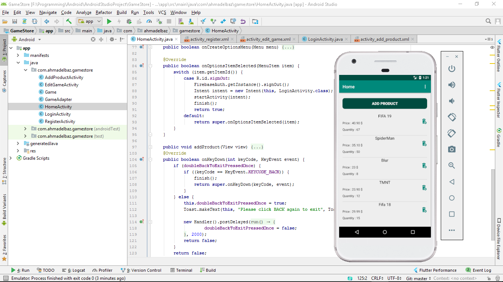
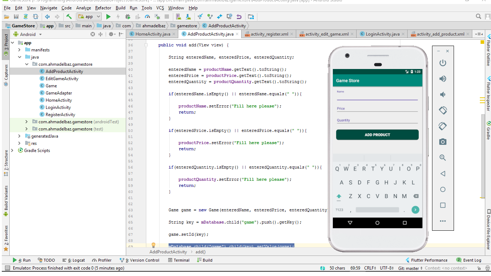
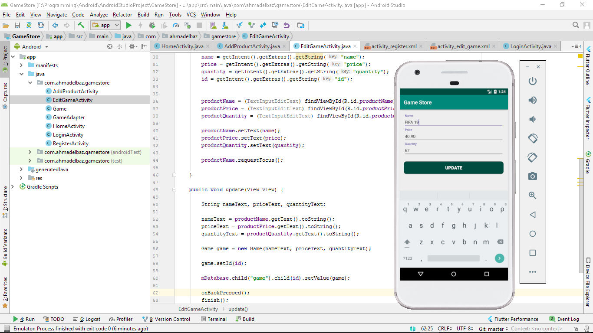
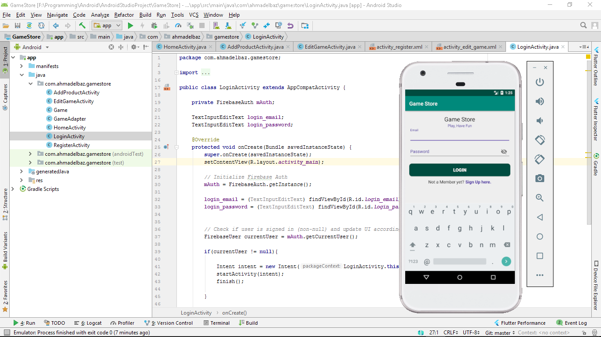
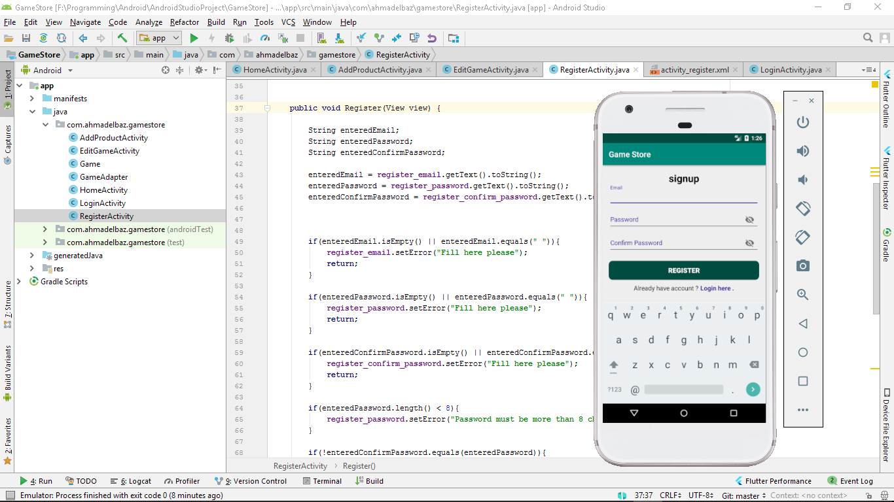

# Game Store
Android app game store allows user to add and edit games wit details

Game Store Android java Android Studio.

Android store app with authentication with Firebase Auth. 
Add products(Games) with details, edit on it and delete it.

the app has no specific rules right now, but it is an initial draft to a store app with good features.

